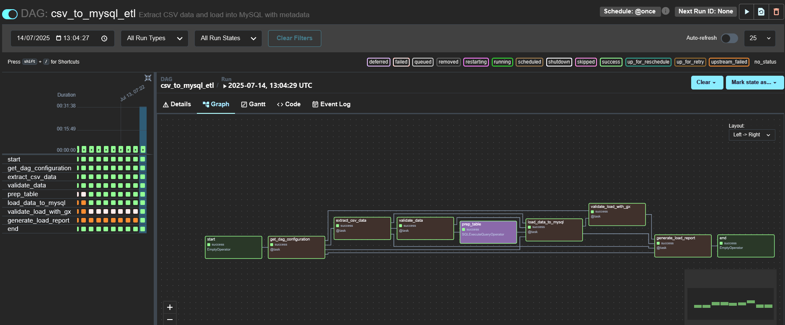
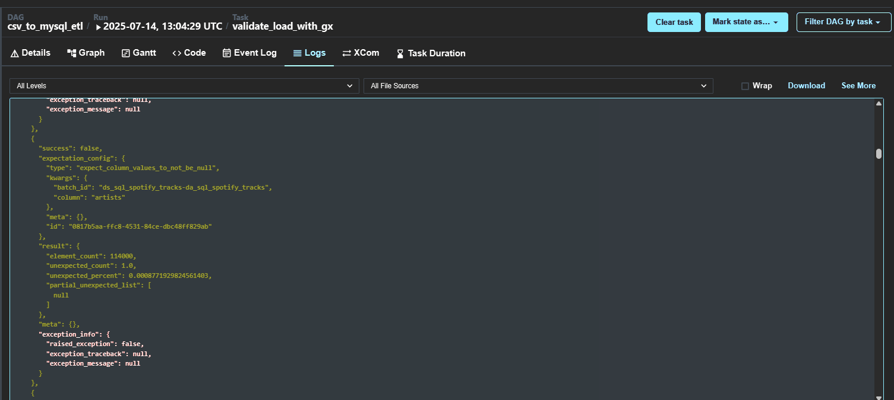
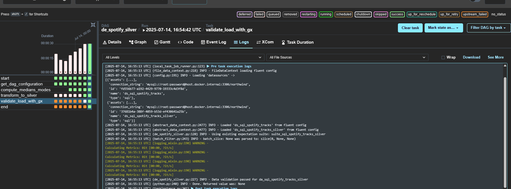
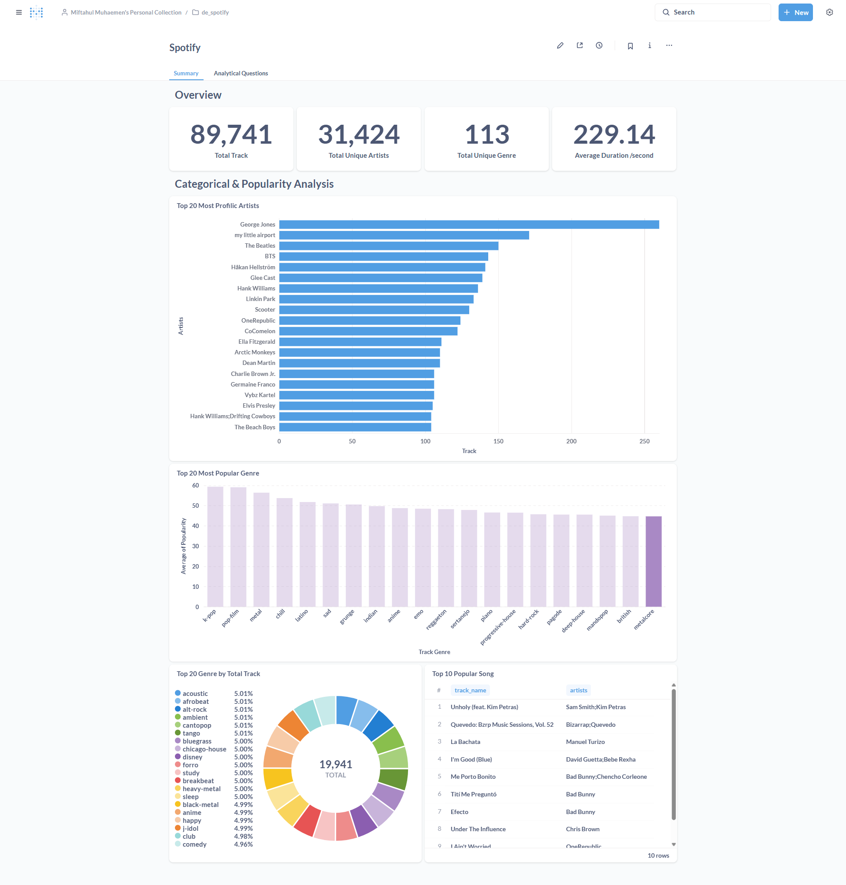
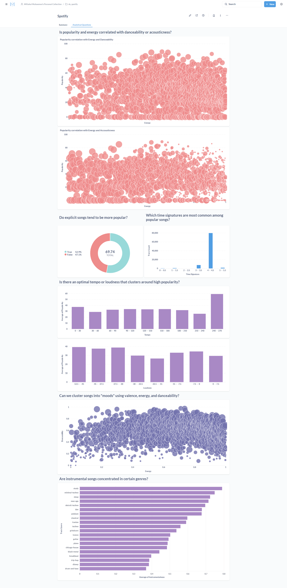

# Spotify Tracks Dataset Analysis

## Introduction
This project demonstrates a modern data engineering workflow using the popular Spotify Tracks dataset. The goal is to showcase end-to-end ETL (Extract, Transform, Load) practices, data validation, and analytics readiness using industry-standard tools. The dataset, sourced from Kaggle, offers a rich ground for analysis, featuring a wide range of track attributes and popularity metrics. Its high usability score (100%) and the personal interest in music analytics make it an excellent choice for a portfolio project, even though it consists of a single fact table without dimension tables due to its pre-aggregated nature.

## Project Directory Structure

```
airflow/dags/
├── csv/
│   └── dataset.csv
├── sql/
│   ├── de_spotify_create_table.sql
│   ├── de_spotify_silver.sql
│   └── ... (other SQL scripts)
├── de_spotify_to_bronze.py
├── de_spotify_silver.py
└── ... (other DAGs and files)
```

## Project Architecture & Flow
The pipeline is designed to move data from raw CSV to a structured, query-ready database, with robust validation at each stage. The process is orchestrated using Apache Airflow, with data stored in MySQL and visualized in Metabase. The workflow is divided into two main layers:

- **Bronze Layer:** Raw ingestion of the dataset, minimal transformation, and metadata enrichment.
- **Silver Layer:** Cleansing, imputation of missing values, deduplication, and further validation to ensure data quality.

There is no Gold layer in this project, as the dataset is already simple and pre-aggregated, making further aggregation unnecessary.

## Dependencies & Required Services
To run this project, the following services and libraries are required (tested on Linux):

- **Apache Airflow (Standalone):** 2.10.5
- **MySQL Database:** (Recommended to run via Docker)
- **Metabase:** (Recommended to run via Docker)
- **DBeaver:** (For database exploration during development)
- **Python Libraries:**
  - apache-airflow 2.10.5
  - apache-airflow-providers-mysql 6.3.0
  - apache-airflow-providers-common-sql 1.21.0
  - great-expectations 1.5.5
  - numpy 1.26.4
  - pandas 2.1.4

> Note: Users are free to choose their preferred installation methods for Airflow, MySQL, and Metabase. This project assumes a working Linux environment.

## Step-by-Step Data Pipeline

### 1. Data Acquisition
- Download the dataset from Kaggle: [Spotify Tracks Attributes and Popularity](https://www.kaggle.com/datasets/melissamonfared/spotify-tracks-attributes-and-popularity)
- Place the CSV file in the designated directory as referenced by the Airflow DAGs.

### 2. Bronze Layer: Raw Ingestion

- The Airflow DAG ingests the raw CSV data into a MySQL table (`spotify_tracks`).
- Metadata columns (e.g., ingestion timestamp, batch identifier) are added.
- **Step 1: Extraction Validation (Pandas)**
  - After loading the CSV, the pipeline uses pandas to check for nulls in key columns, validate data types, and ensure the integrity of the extracted data before any database operation.
- **Step 2: Database Validation (Great Expectations)**
  - Once data is loaded into MySQL, the pipeline uses Great Expectations to validate the data directly in the database. Great Expectations is a powerful, open-source data quality tool that allows you to define, document, and test data expectations in a reusable and automated way. It’s especially valuable for portfolio and production projects because it provides clear, human-readable validation results and integrates well with modern data stacks.
  

### 3. Silver Layer: Cleansing & Imputation
- A second Airflow DAG processes the bronze table to create a silver table (`spotify_tracks_silver`).
- Missing values in numeric columns are imputed with medians; categorical columns use modes. In this project, these statistics are precomputed in Python, but it is equally valid to perform such imputations directly in SQL, which can be more efficient for large datasets or when working entirely within the database environment.
- Deduplication is performed based on track ID.
- Additional data validation ensures all required fields are present and within expected ranges.


### 4. Data Exploration (Metabase)
- The cleansed and validated data in the silver table is ready for analysis and dashboarding in Metabase.
- Connect Metabase to the MySQL database to begin exploring and visualizing the data.

### 5. Report Visualization on Metabase



## Author
**Miftahul Muhaemen**  